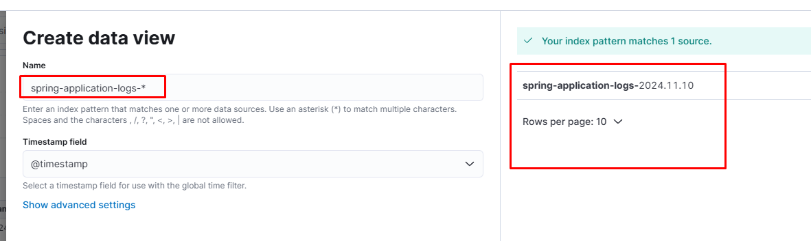
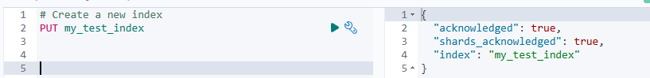
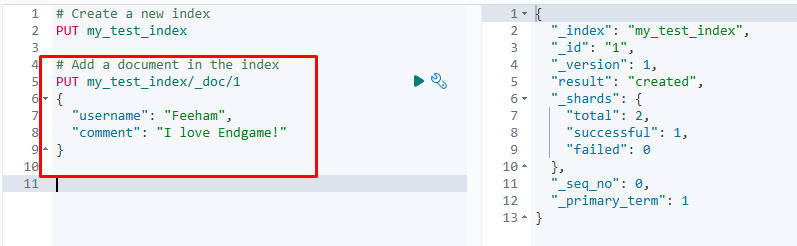
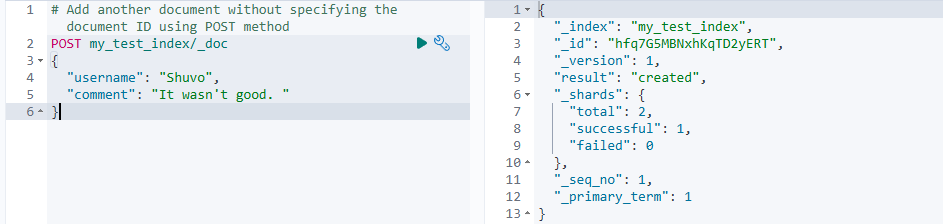
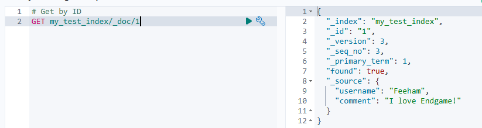
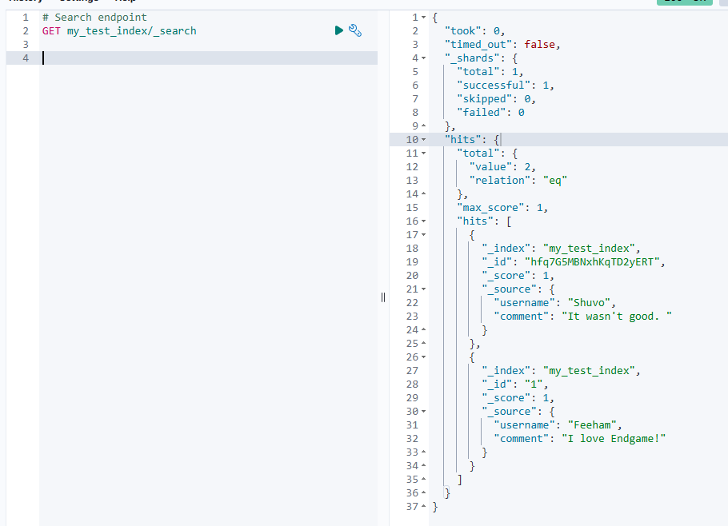
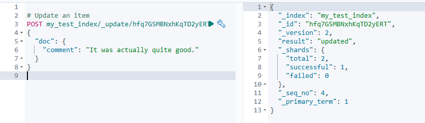
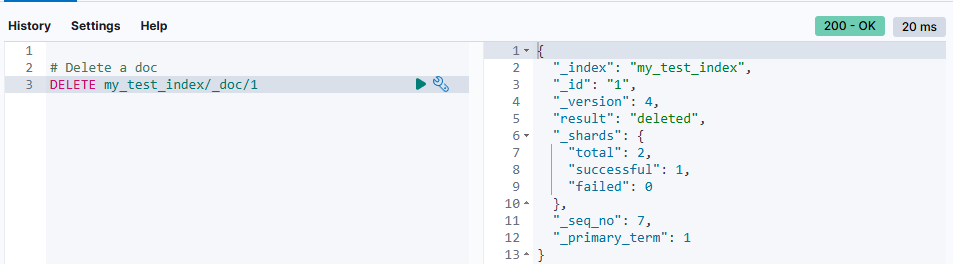

### All about my https://github.com/feehaam/Centralized_Logging_ELK repo
#### Elastic search runs on port 9200 with basic settings

#### Kibana runs after elastic search and connects to it

#### Logstash runs after elastic search and runs ports for different types of logs channel, here the first and the second one we will use from our two applications. It also reads the logstash.yml file and configures from it. 

#### Spring app 2 is set with minimal configuration, sends logs directly to logstash through TCP socket

#### But as the TCP socket is not consistent & insecure, spring app 1 use filebeat to send logs to logstash, so its logback-spring.xml setting is little different

#### Note that, there is also a file reference in the xml, as filebeat reads from file here so we need to write the application logs (not just in console only but also) in a file too. So we configured in application setting to write in /logs/app.log file

#### Filebeat reads from the file and stores in its own docker container storage

#### It beats and checks input from the defined path (its container storage for logs) and sends to output host (logstash)

#### Finally, logstash config gets the input from beat (app 1) abd tcp (app 2) and sends to elastic search in the defined index

#### Then from kibana UI (port 5601) we can create a new data view on that elastic index and analyze 

#### `Q` What type of search elastic search offers?

#### `Q` How elastic search stores data?

#### `Q` What is index in ES?

#### `Q` What is nodes in ES?

#### `Q` What is Cluster in ES?

#### `Q` What is Shard in ES and how it works?

#### `Q` How to create an index? 

#### `Q` How to add a document?
Use put method with specified ID and the document.

#### `Q` How to create a document without ID?
Use the post method and it assigns a random ID. 

#### `Q` How to get a document?

#### `Q` How to search? 

#### `Q` How to update a document? 

#### `Q` How to delete? 

#### `Q` What is a Query DSL in elastic search? 

#### `Q` What are the different queries? Define each (range, term, match)

#### `Q` How scoring is done in elastic search? (TF, IDF, QB, FLN)

#### `Q` What happen if you try to sort by or aggregate by a text field? 

#### `Q` What is aggregation in ES? 

#### `Q` What are inverted index? 

#### `Q` What are different analyzers and its mechanism in ES? 

#### `Q` What are character filters, tokenizer and filter?

