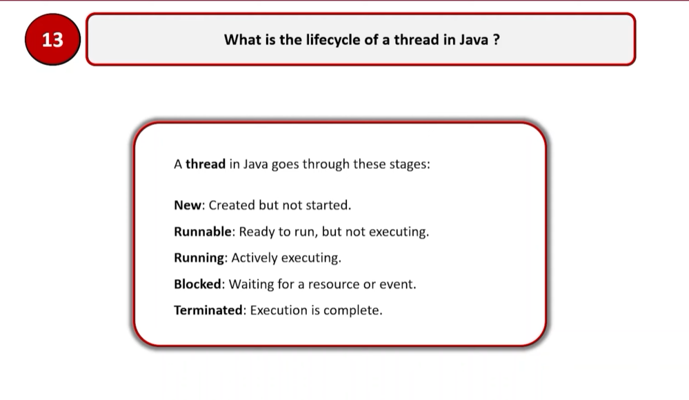
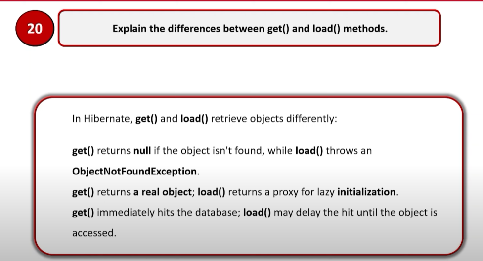
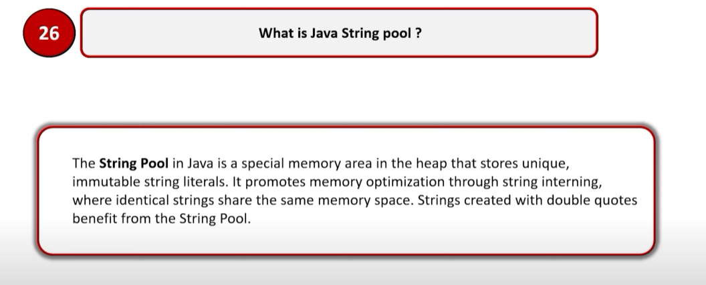
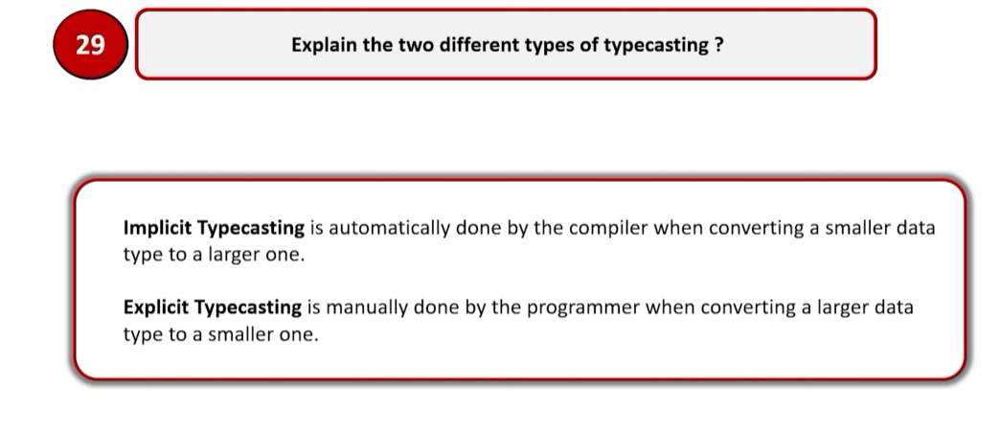

## General Questions
- Tell us about yourself
  - What is your role in the team?
  - What is your project about?
  - Tell us about your team, team size, structure?
  - Share your experience of work and strategies usually followed?
    - How did you handle a new requirement (analyze)
    - How did you handle code quality (review)
- How many types of inheritance? 
- Why stringBuilder is better than traditional string concatenation?
- Why String is immutable? 
- What is marker interface and why it is used?
- What is Serializable? 
- What is serialVersionUID? 
- How HashMap works?
- How HashSet works?
- How HashTable works & What are its drawbacks? 
- What is ConcurrentHashMap?
    - How it is different? 
    - How it works? 
    - How bucket/segment work in ConcurrentHashMap?
    - What is concurrency level in ConcurrentHashMap?
    - At most how many threads can access without waiting ConcurrentHashMap at a time?
    - Why write is locked only why not read? 
- What is volatile keyword?
- What is synchronized keyword?
- What is the difference between volatile & synchronized?
- What is garbage collector? 
  - How objects are garbage collected?
  - What is old gen object & young gen object? 
  - How can you let an object to be garbage collected?
- What is SOLID principle? 
  - What is single responsibility principle?
  - What is Open closed principle?
  - What is Liskov substitution principle?
  - What is Interface segregation principle?
  - What is Dependency inversion principle?
- Explain thread life cycle.
- What is multithreading?
- What are the Comparable and Comparator interfaces, when to use which one?
- When is marker interfaces used, where they used & why they are used?
- How lock is applied?
  - Explain necessity of locks. 
  - Explain different types of locks.
  - What is deadlock?
- What is try with resource & what is it used for?
- What do we update to microservice from monolith? 
- What is the necessity of sequence diagram?
- Explain spring security, how it works? 
- How do you approach designing a scalable architecture in Java Spring Boot for a high-traffic application, focusing on maintaining code quality and performance?
- Can you discuss how you ensure code quality and maintainability in your Java Spring Boot projects, particularly when working with large codebases?
- Can you describe a complex server-side logic problem you've solved using Java Spring Boot, and how you ensured its robustness and maintainability?
- Can you describe your experience with optimizing MySQL queries for performance in large-scale applications?
- Can you share an example where you've implemented database partitioning in MySQL, and what specific benefits did you observe from this approach?
- Can you describe how you handle versioning of your APIs to ensure backward compatibility and smooth transitions for front-end developers?
- Can you share an example of a time when you had to modify an existing API to add new features while ensuring that the changes did not break existing integrations with front-end applications? How did you collaborate with the front-end team during this process?
- Can you explain EC2, AWS Lambda, S3, Functions and similar services that you are aware of? 
- Can you explain how can you ensure security in the external services like AWS? 
- What are the difference between Orchestration & Choreography?
- 
- What is aggregation & composition in java? 
- What is an anonymous inner class?
- What is System class? 
- What is a daemon thread, why it is used? 

- What is wrapper class? 

- What is servlet? 
- How do you monitor spring boot application? 

## Java Platform

  
Why is Java so popular?

    Java is popular due to its platform independence, object-oriented nature, large community support, extensive libraries, and strong security features.

  
What is platform independence?

    Java is platform independent because it can be executed on any platform that supports the Java Virtual Machine (JVM). 
This means that the same Java code can be executed on different operating systems, hardware, and programming languages.

  
What is bytecode?

  Bytecode is the intermediate representation of Java code that is generated by the Java compiler. It is 
platform-independent and can be executed by the JVM.

  
Compare between JDK vs JVM vs JRE.

  JDK (JRE (JVM - runner machine) - library & tools) - development kit full package.

  
What is the role for a classloader in Java?

  A class loader has two main functions: Load classes, locate resources. The Java run-time supports three built-in class loaders: Bootstrap, platform, system class loader.
An instance of java.lang.ClassLoader loads Java classes. However, class loaders are classes themselves. So the question is, who loads the java.lang.ClassLoader itself?
Bootstrap class loader serves as the parent of all the other ClassLoader instances. This bootstrap class loader is part of the core JVM and is written in native code. 
The platform class loader is a child of the bootstrap class loader and takes care of loading the standard core Java classes. 
The system or application class loader, on the other hand, takes care of loading all the application-level classes into the JVM
Examples: Bootstrap class loader: loads the core Java classes from the rt.jar file || Platform class loader: loads the classes from the Java platform modules, such as java.base, java.sql, etc. || 
System class loader: loads the classes from the classpath, such as the classes in the application JAR files.

## Wrapper Classes

  
What are Wrapper classes?

  Wrapper classes are classes that are used to represent primitive data types in Java. They are used to convert primitive data types to object form and vice versa.

  
Why do we need Wrapper classes in Java?

1. Wrapper classes are used to convert primitive data types to object form and vice versa. 
2. They are used to store primitive data types in collections, such as ArrayList, HashMap, etc. 
3. They provide utility methods for converting between different data types.

  
What are the different ways of creating Wrapper class instances?

1. Using the valueOf() method of the wrapper class. 
2. Using the constructor of the wrapper class. 
3. Using the parse() method of the wrapper class.

  
What are differences in the different ways of creating Wrapper classes?

1. The valueOf() method is used to create a wrapper class instance from a String representation of the primitive data type. 
2. The constructor is used to create a wrapper class instance from a primitive data type. 
3. The parse() method is used to create a wrapper class instance from a String representation of the primitive data type.
4. The valueOf() method caches the instances of the wrapper class for performance optimization, while the constructor creates a new instance every time.
5. The parse() method is used to convert a String representation of a primitive data type to the corresponding primitive data type.

  
What is auto boxing?

    Auto boxing is the process of converting a primitive data type to its corresponding wrapper class instance automatically by the Java compiler.

  
What are the advantages of auto boxing?

1. It simplifies the code by eliminating the need for explicit conversion between primitive data types and wrapper classes.
2. It improves code readability and maintainability by reducing the amount of boilerplate code.
3. It allows for easier manipulation of primitive data types in collections and other data structures that require objects.

  
What is casting?

    Casting is the process of converting one data type to another. In Java, there are two types of casting: implicit casting (automatic) and explicit casting (manual). 

  
What is implicit casting?

    Implicit casting is the process of converting one data type to another automatically by the Java compiler. Example: converting an int to a long, or a float to a double.

  
What is explicit casting?

    Explicit casting is the process of converting one data type to another manually by the developer. Example: converting a long to an int, or a double to a float.

## Strings

  
Are all String’s immutable?

    Yes, all String objects are immutable in Java. Once a String object is created, its value cannot be changed.

  
Where are String values stored in memory?

    String values are stored in the String pool, which is a special area of memory in the Java heap.

  
Why should you be careful about String concatenation(+) operator in loops?

    String concatenation using the + operator creates a new String object every time it is used, which can lead to performance issues in loops. 
    It is better to use StringBuilder or StringBuffer for concatenation in loops.

  
What are differences between String and StringBuffer?

    String is immutable, while StringBuffer is mutable. This means that String objects cannot be changed after they are created, while StringBuffer objects can be modified. 
    StringBuffer is also synchronized, which makes it thread-safe, while String is not.

  
What are differences between StringBuilder and StringBuffer?

    StringBuilder is not synchronized, while StringBuffer is synchronized. This means that StringBuilder is faster than StringBuffer in single-threaded environments, 
    while StringBuffer is safer to use in multithreaded environments.

  
Can you give examples of different utility methods in String class?

    Some examples of utility methods in the String class are: 
    1. length() - returns the length of the string.
    2. charAt(int index) - returns the character at the specified index.
    3. substring(int beginIndex, int endIndex) - returns a substring of the string.
    4. indexOf(String str) - returns the index of the first occurrence of the specified string.
    5. toUpperCase() - converts the string to uppercase.
    6. toLowerCase() - converts the string to lowercase.

## Object-oriented programming basics

  
What is a class?

    A class is a blueprint for creating objects in Java. It defines the properties and behaviors of the objects that can be created from it.

  
What is an object?

    An object is an instance of a class in Java. It represents a specific entity that has its own state and behavior.

  
What is state of an object?

    Basically the set of values in an instance, the state of an object is represented by its instance variables or attributes. 
It defines the characteristics of the object at a given point in time.

  
What is behavior of an object?

    The behavior of an object is represented by its methods. It defines the actions that the object can perform.

  
What is the super class of every class in Java?

    The super class of every class in Java is the Object class.

  
Explain about toString method ?

    The toString() method is a method of the Object class that returns a string representation of the object.
We can override this method in our classes to provide a custom string representation of the object.
However, if we do not override this method, the default implementation returns the class name followed by the hash code of the object.

  
Explain about the hashCode method? 

    The hashCode() method in Java is used to generate an integer representation of an object's state. 
This hash code is primarily used for efficient storage and retrieval of objects in hash-based data structures like HashMap and HashSet. 
The default implementation of hashCode() in the Object class usually returns a hash code derived from the object's memory address.

  
What is the use of equals method in Java?

    The equals() method in Java is used to compare two objects for equality.If the equals() method is not overridden, 
it inherits the default implementation from the Object class. This default implementation uses the == operator, which checks for reference equality.

  
What are the important things to consider when implementing equals method?

    1. Reflexivity: For any non-null reference value x, x.equals(x) should return true.
    2. Symmetry: For any non-null reference values x and y, x.equals(y) should return true if and only if y.equals(x) returns true.
    3. Transitivity: For any non-null reference values x, y, and z, if x.equals(y) returns true and y.equals(z) returns true, then x.equals(z) should return true.
    4. Consistency: For any non-null reference values x and y, multiple invocations of x.equals(y) should consistently return true or consistently return false.
    5. Non-nullity: For any non-null reference value x, x.equals(null) should return false.

  
Explain inheritance with examples. 

    Inheritance is a mechanism in Java that allows one class to inherit the properties and behaviors of another class.
    The class that is inherited from is called the parent class or superclass, and the class that inherits from it is called the child class or subclass.
    The child class inherits all the properties and behaviors of the parent class, but can also have its own properties and behaviors.

  
What is method overloading?

    Method overloading is a feature in Java that allows a class to have multiple methods with the same name but different parameter lists.

  
What is method overriding?

    Method overriding is a feature in Java that allows a subclass to provide a specific implementation of a method that is already defined in its superclass.
    The method in the subclass must have the same name, return type, and parameter list as the method in the superclass.

  
Can super class reference variable can hold an object of subclass?

    Yes, a superclass reference variable can hold an object of its subclass. This is known as polymorphism in Java.
    It allows us to use a single reference type to refer to objects of different classes in the same inheritance hierarchy.

  
Is multiple inheritance allowed in Java?

    No, multiple inheritance is not allowed in Java. Java does not support multiple inheritance to avoid ambiguity and complexity that can arise from it.
Though, Java does support multiple inheritance through interfaces. A class can implement multiple interfaces, allowing it to inherit behavior from multiple sources.

  
What is an interface?

    An interface is a contract that specifies the methods and properties that a class must implement.

  
Can you explain a few tricky things about interfaces?

1. Interfaces methods by default are public and abstract.
    1. Interfaces can contain default methods, static methods, and private methods in addition to abstract methods.
    2. A class can implement multiple interfaces, allowing it to inherit behavior from multiple sources.
    3. Interfaces can extend other interfaces, allowing for a hierarchical structure of interfaces.
    4. Interfaces cannot have instance variables, but they can have constants (static final variables).

  
What is an abstract class?

    An abstract class is a class that cannot be instantiated and can contain abstract methods (methods without a body) as well as concrete methods (methods with a body).
    Abstract classes are used to provide a common base for subclasses to inherit from. 

  
 When do you use an abstract class?

    An abstract class is used when you want to provide a common base for subclasses to inherit from, but you do not want the base class to be instantiated. 
    It is also used when you want to define some common behavior that can be shared among subclasses, while still allowing subclasses to provide their own specific implementations.

  
Compare abstract class vs interface?

    1. An abstract class can have instance variables, while an interface cannot.
    2. An abstract class can have concrete methods, while an interface can only have abstract methods (prior to Java 8).
    3. A class can extend only one abstract class, but it can implement multiple interfaces.
    4. An abstract class can have constructors, while an interface cannot.

  
What is a constructor?

    A constructor is a special method in Java that is used to initialize objects. It is called when an object of a class is created and has the same name as the class.
    Constructors do not have a return type, not even void.

  
What is a default constructor?

    A default constructor is a constructor that does not take any parameters. It is automatically provided by the Java compiler if no constructors are defined in the class.
    If a class has at least one constructor defined, the compiler does not provide a default constructor.

  
How do you call a super class constructor from a constructor?

    You can call a super class constructor from a constructor by using the super keyword.
    The super keyword is used to refer to the parent class or superclass.

  
What is the use of this()?

    The this() keyword is used to call another constructor in the same class. It is used to avoid code duplication and to provide a common initialization logic for multiple constructors.

  
Can a constructor be called directly from a method?

    No, you cannot call a constructor from a method. The only place from which you can invoke constructors using“this()” or, “super()” 
is the first line of another constructor. If you try to invoke constructors explicitly elsewhere, a compile time error will be generated.

  
Is a super class constructor called even when there is no explicit call from a subclass constructor?

    Yes, a super class constructor is called even when there is no explicit call from a subclass constructor.

## Advanced object-oriented concepts

  
What is polymorphism?

    Polymorphism is a feature in Java that allows a single method or property to behave differently based on the object that it is called on. 
    There are two types of polymorphism in Java: compile-time polymorphism (method overloading) and runtime polymorphism (method overriding).

