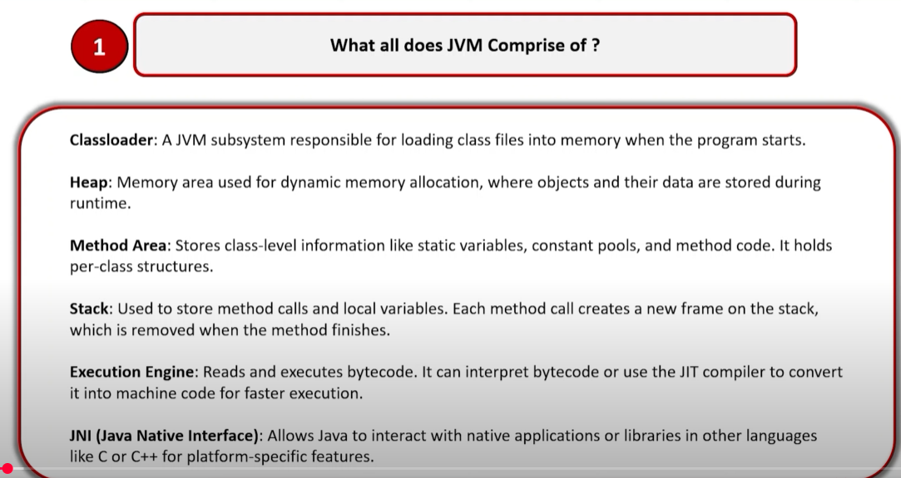
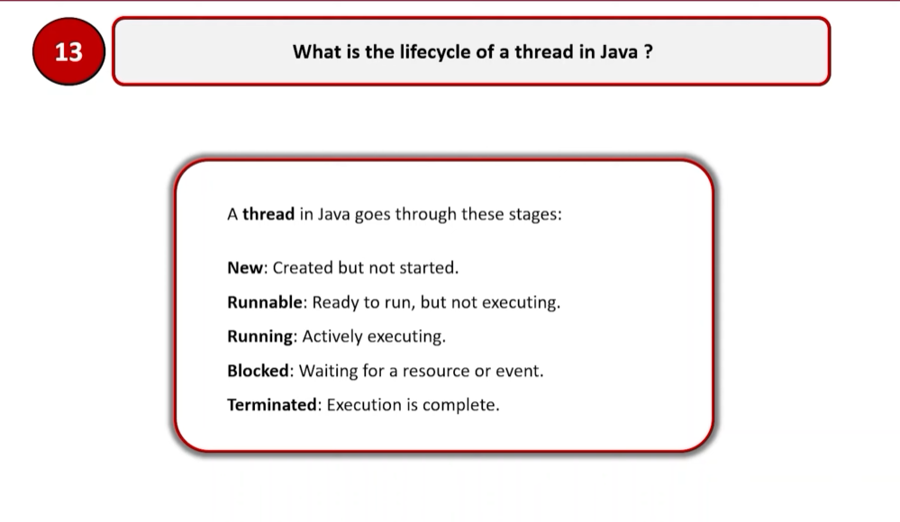
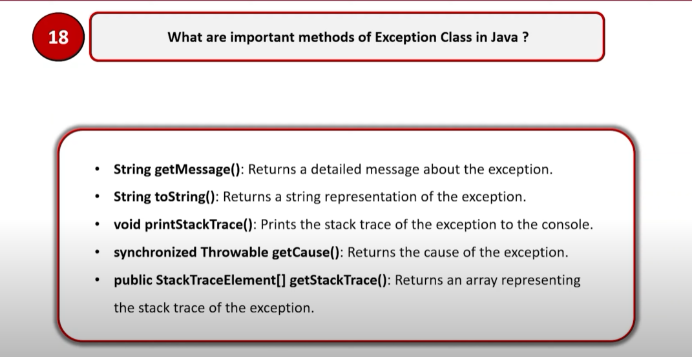
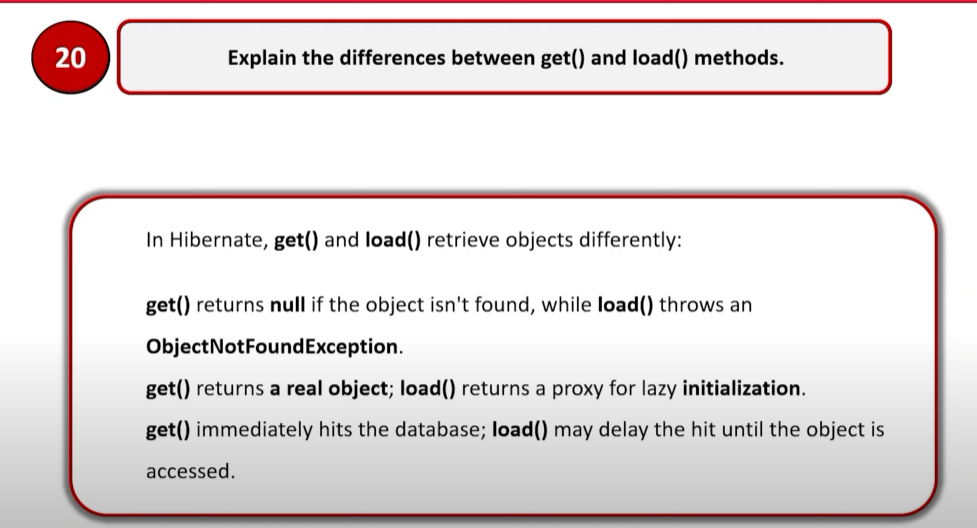
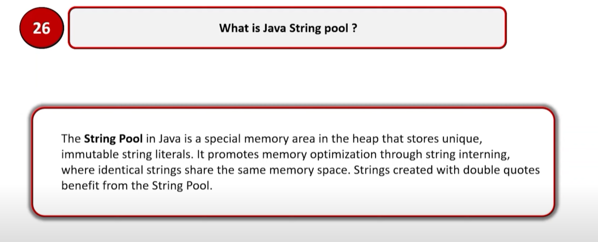
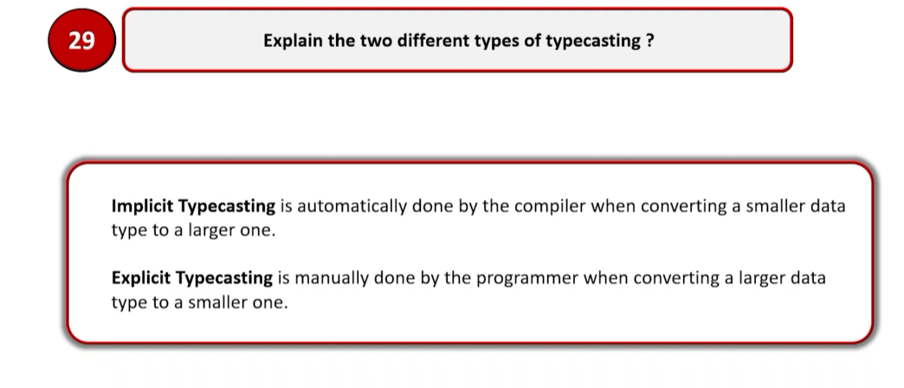

- Tell us about yourself
  - What is your role in the team?
  - What is your project about?
  - Tell us about your team, team size, structure?
  - Share your experience of work and strategies usually followed?
    - How did you handle a new requirement (analyze)
    - How did you handle code quality (review)
- How many types of inheritance? 
- Why stringBuilder is better than traditional string concatenation?
- Why String is immutable? 
- What is marker interface and why it is used?
- What is Serializable? 
- What is serialVersionUID? 
- How HashMap works?
- How HashSet works?
- How HashTable works & What are its drawbacks? 
- What is ConcurrentHashMap?
    - How it is different? 
    - How it works? 
    - How bucket/segment work in ConcurrentHashMap?
    - What is concurrency level in ConcurrentHashMap?
    - At most how many threads can access without waiting ConcurrentHashMap at a time?
    - Why write is locked only why not read? 
- What is volatile keyword?
- What is synchronized keyword?
- What is the difference between volatile & synchronized?
- What is garbage collector? 
  - How objects are garbage collected?
  - What is old gen object & young gen object? 
  - How can you let an object to be garbage collected?
- What is SOLID principle? 
  - What is single responsibility principle?
  - What is Open closed principle?
  - What is Liskov substitution principle?
  - What is Interface segregation principle?
  - What is Dependency inversion principle?
- Explain thread life cycle.
- What is multithreading?
- What are the Comparable and Comparator interfaces, when to use which one?
- When is marker interfaces used, where they used & why they are used?
- How lock is applied?
  - Explain necessity of locks. 
  - Explain different types of locks.
  - What is deadlock?
- What is try with resource & what is it used for?
- What do we update to microservice from monolith? 
- What is the necessity of sequence diagram?
- Explain spring security, how it works? 
- How do you approach designing a scalable architecture in Java Spring Boot for a high-traffic application, focusing on maintaining code quality and performance?
- Can you discuss how you ensure code quality and maintainability in your Java Spring Boot projects, particularly when working with large codebases?
- Can you describe a complex server-side logic problem you've solved using Java Spring Boot, and how you ensured its robustness and maintainability?
- Can you describe your experience with optimizing MySQL queries for performance in large-scale applications?
- Can you share an example where you've implemented database partitioning in MySQL, and what specific benefits did you observe from this approach?
- Can you describe how you handle versioning of your APIs to ensure backward compatibility and smooth transitions for front-end developers?
- Can you share an example of a time when you had to modify an existing API to add new features while ensuring that the changes did not break existing integrations with front-end applications? How did you collaborate with the front-end team during this process?
- Can you explain EC2, AWS Lambda, S3, Functions and similar services that you are aware of? 
- Can you explain how can you ensure security in the external services like AWS? 
- What are the difference between Orchestration & Choreography?
- 
- What is aggregation & composition in java? 
- What is an anonymous inner class?
- What is System class? 
- What is a daemon thread, why it is used? 

- What is wrapper class? 

- What is servlet? 
- How do you monitor spring boot application? 
- 