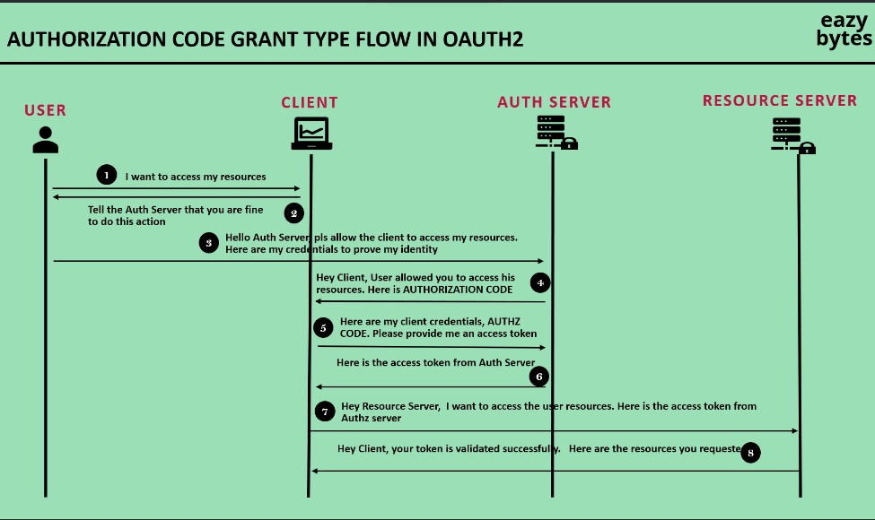
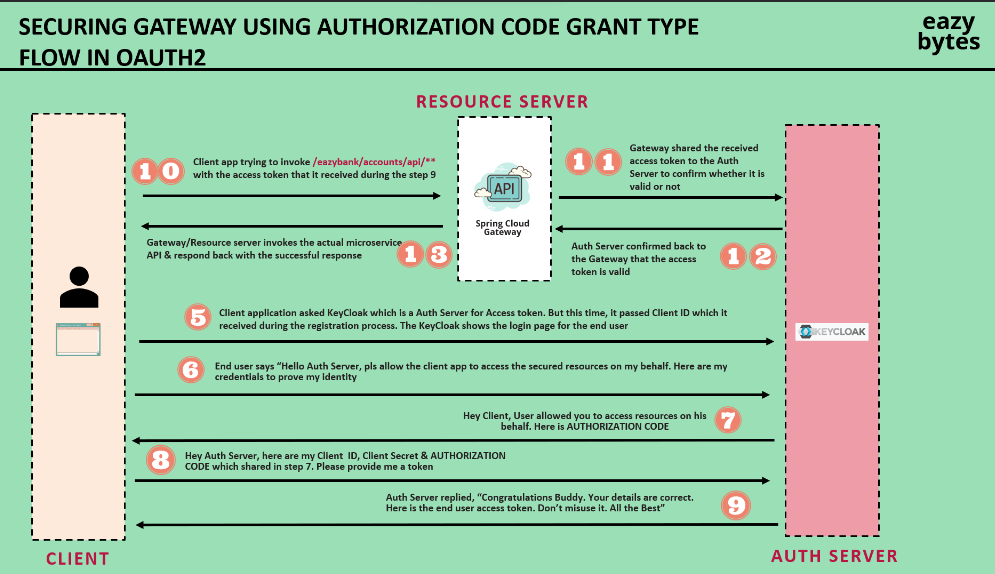

OAuth 2.1 is a protocol that allows clients to obtain access tokens from an authorization server, which can then be used to access protected resources on the client's behalf.
The OAuth 2.1 protocol is based on the OpenID Connect protocol, which is a standard for user authentication and authorization in the context of web applications. 
OpenID Connect provides a way to authenticate users and authorize them to access resources on a web server, while OAuth 2.1 provides a way for clients to obtain access tokens from an authorization server.

- OpenID provides authentication, while OAuth provides authorization.
- Service that handles there two together is called Authorization Server or IAM(Identity and Access Management).
- IAM is just another microservice that handles authentication and authorization.
- Besides Auths, OIDC(OpenID Connect) also provides user information like email, name, etc. exposing the endpoint /userinfo to the client.
- There are many IAM providers like Okta, Auth0, Google, Keycloak etc.
- After adding and IAM with API Gateway, no need to expose docker port to outside world as services will communicate within same docker network & we'll only hit API Gateway.

    Q: Explain the steps of authorization code grant flow?

