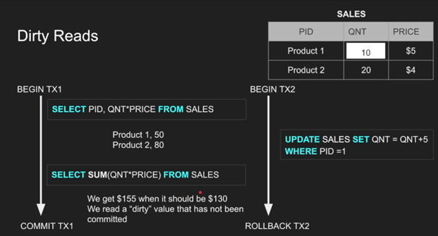

# ```The ACID PRINCIPLE```
## ```Transaction```
-	Multiple queries treated as a single unit of work.
-	Transaction lifecycle consists of 4 parts internally: BEGIN, COMMIT 
(Store in memory/RAM), WRITE (Store in disk).
-	However, these can differ by DB engines, each DB engine has its own customized and 
complex transaction management system. Some focus more on commits some focus on crashes 
while some try to balance.
-	For COMMIT & WRITE there can be two approaches basically.
-	Each smaller unit is committed and written in disk -> needs lots of I/O, very fast, 
hard to rollback, used by Postgres
-	Every commit is prepared first then all are stored in disk -> slower, less IO, low 
failure chance, easier rollback
-	<code style="color : gold">But, what if the DB crash during a commit?</code>
-	Read only transaction is also normal, because it gives snapshot of a moment, without
transaction, in regular reads, things may get changed in the middle.

**Example of a transaction**


## Atomicity
Let’s say for the first example, we’ve deducted from the first account and then the 
DB crashed! The balance is never added in second account!
**Def: A block of queries must be executed entirely or none at all.**

## Isolation
Operations must be separated from all the outside-block actions. Traditional 
isolation related problems include <code style="color : gold">Non-repeatable read</code> 
(in a single block there are two read queries on the same table, after the first query 
another query from another thread updates data and commits so the second query reads 
different!), <code style="color : gold">Dirty read</code> (similar to non-repeatable but in this one, the second thread 
changes mind and doesn’t commit changes & rolls back after first thread’s second query),
<code style="color : gold">Phantom read</code> (in this case, instead of updating, a new row is inserted by other thread. 
As it is completely new and first thread has no idea of it, so it is the hardest to fix),
<code style="color : gold">Lost update</code> (the most common concurrency issue, two thread reads data, thread 1 updates it,
thread 2 updates it, the update of thread 1 is overwritten.)

**Example of dirty read:**



Different database uses different isolation levels by default to prevent different 
reading phenomena.

_Table: Isolation levels vs read phenomena_

| Isolation level | Dirty reads  | Lost updates | Non-repeatable reads | Phantoms |
|-----------------|--------------|--------------|----------------------|----------|
|Read Uncommitted| May occur    |May occur|May occur|May occur|
|Read committed| Don’t occur  |May occur|May occur|May occur|
|Repeatable read| Don’t occur  |Don’t occur|Don’t occur|May occur|
|Serializable| Don’t occur  |Don’t occur|Don’t occur|Don’t occur|

<code style="color : gold">Read uncommitted</code> – No isolation, <code style="color : gold">Read 
committed</code> – a transaction only sees others’ committed transaction,
<code style="color : gold">Repeatable read</code> – while a transaction is running, 
its usages rows will not be changed, kind of locking, 
<code style="color : gold">Serializable</code> – disables concurrency,
<code style="color : gold">Snapshot</code> – takes a snapshot of entire context and uses it during whole transaction.

Also, for locking, there are two types of locks. Pessimistic locks 
the context (row, table, page), Optimistic (doesn’t lock at all, triggers 
error/fail for a transaction when any anomaly happens.

## Consistency
If a data is updated, all other related (other table, foreign key, 
other lined database etc.) and dependent data shall get the update immediately.

## Durability
Database must store data in disk and shouldn’t lie without actually saving. As a result, DB engines ignores OS cache and stores data in disk by its own using f-sync commands.

## Storing data
A row is a single record, a column is a set of single attribute values, a row_id field is used by default in many databases which actually behaves like primary column internally, a page is a logical block with fixed size (8KB in Postgres, 16KB in MySQL) consists of multiple rows/columns, an IO is a read/write operation, it reads one or more page at once, cannot read single row/column. IO is expensive. IO reads from OS Cache too, not always from disk. Optimizing an IO is DB engines’ one of the major goals, while reducing its use is programmers’ major goal. Tables are stored in Heap DS, traversing Heap is expensive as it gives you all pages and requires iterating through everything to find a row. Index is another DS which keeps pointers to heap using B-Tree. Example of reading from index & heap using two IO (imagine finding last row without index!)

Data storing can be both row and column based, the above one is example of row based, however in column-based storing, only a limited (equals to number of columns) number of rows are created, each row contains all the values for a particular column. Example:

Good for aggregation, good for compression (as multiple record has same value so stored as value as a key with list of record id), very problematic in queries especially in select * queries!

Index oriented tables
An index-oriented table or a clustered table is the one which’s rows are organized based on the primary key, meaning that the row with primary key N+1 will always be after row N and before N+2. Fast but space-costly! i.e.: row with PK 1 and 3 are inserted, an empty row for PK 2 will be reserved. It’s by-default in MySQL, Postgres doesn’t have it (as it has a default PK internally and all user defined PK is actually SK), other DB allows to create it.

Hands on with indexing
Time to practice some indexing related queries!


More on Indices
A scenario: If a table has columns a, b, c and we have index(a, b) then:
•	Query with ‘a or b’: parallel seq scan – 167ms -> same as without index
•	Query with ‘a and b’: index scan – 4ms -> fast because of index
•	Query with ‘b’: parallel seq scan – 176ms -> same as without index
•	Query with ‘a’: bitmap index scan – 6ms -> special case: as a column is first key in index, its fast!
There are different types of scans. Index scan, Bitmap index scan, table scan (these names are based on PG, name can vary through DB’s however implements conceptually same thing). Sequential scan or table scan is the brute force, traditional, top to bottom iteration of pages and rows in a table. Parallel IO is used to make the scan faster, it is O(N) in terms of time complexity. Index scan is the faster one with O(logN) time complexity as it searches in the index tree, on the other side the Bitmap index scan is somewhere between the above two. Though index search is fast but jumping between index and the heap memory is costly as it requires IO, as a result, for a ranged query where there can be a lot of results the DB engine first operates index scan and prepares a bit map for pages. For example –
Page 1	Page 2	Page 3	Page 4	Page 5	Page 6
0	0	1	0	1	0

Of course, the actual table may be more complex with additional information but the minimal one shown here means that we need to scan page 3 and page 5 to prepare query result. So, it does index scan -> prepares bitmap then jumps to heap for once only. Time complexity is same as index scan but this one is space costly because of the bitmap table.
Bloom filter: In cases where we require very simple yet extremely repetitive query such as whether an email or username exists or not, a hash-based elimination probability analyzer algorithm called bloom filter comes in! Using multiple hash functions and a bit array, it quickly and space-efficiently checks a probability of an items existence; query is executed only after it says the data may exist.

Indexing data structures
B Tree	B+ Tree
Properties		All leaves are at the same level.
	B-Tree is defined by the term minimum degree t. The value of t depends upon disk block size.
	Every node except the root must contain at least t-1 keys.
	All nodes (including root) may contain at most (2*t – 1) keys.
	Number of children of a node is equal to the number of keys in it plus 1.
	All keys of a node are sorted in increasing order. The child between two keys k1 and k2 contains all keys in the range from k1 and k2.
	B-Tree grows and shrinks from the root which is unlike Binary Search Tree. Binary Search Trees grow downward and also shrink from downward.
	Like other balanced Binary Search Trees, the time complexity to search, insert, and delete is O (log n).
	Insertion of a Node in B-Tree happens only at Leaf Node.
	Used as default in PostgreSQL 	Everything is  same as B Tree except for the value storing mechanism. In B+ tree the intermediate nodes doesn’t store any value, only keeps the keys and the leaf nodes stores values, additionaly the leaf nodes keeps a pointer  to the next node which brings lot of facilites wich such little cost.
Used as default in MySQL, Oracle and most other DB systems.  
Search Efficiency	Good, as it maintains a balanced structure for efficient searching	Better, as all values are in leaf nodes, making range queries faster
Insertions/
Deletions

	Efficient, with minimal rebalancing needed due to its balanced nature	Efficient, similar to B-trees, but may involve more rebalancing
Space
Utilization

	Can be less space-efficient as internal nodes store data	More space-efficient as only leaf nodes store data
Range
Queries

	Less efficient, as search may involve traversing internal nodes	More efficient, as all data is at the leaf level, enabling faster range queries
Node Structure	Internal nodes store both keys and values, potentially making them larger	Internal nodes store only keys, making them smaller and faster to navigate


Traversal	May require more traversals due to internal nodes storing data	More straightforward, as traversal is often limited to leaves for data retrieval
Indexing	Suitable for general indexing needs, including key-value pairs	Ideal for indexing where range queries and sorted data access are common

Code: Learn implementing B tree and B+ tree.
Partitioning
Partitioning is storing rows (horizontal) or columns (vertical) in multiple tables based on some logic. The most common types of partitioning are ranged partitioning, list partitioning, hash partitioning, note that all these can be classified as horizontal partitioning. Assume there is a many to many post-reaction table with columns (userId, postId, i reactionType, reactionTime), even doing index on userId or postId will not work because there can be billions of users and trillions of posts! So, what we can do is break the table based on id range! There will be multiple tables with same data each table containing a limited rage amount, for example the first table may have reactions with postId 1-10,000,000 next one with next 10 million then 10 and so on. Partitioning makes tables & queries lighter, faster, complex. Note that
Code: Implement automatic paritioning using Java/Spring and PostgreSQL

Sharding
Sharding is a different concept of distributing the data in different databases. It is needed when there are so much data that the DB space is struggling. It is very similar to partition but only in different server. Sharding can be employed by dividing the data based on a sharding key, such as user ID or geographical region. Each shard contains a subset of the data and operates independently, allowing the system to handle increased traffic and data volume by adding more servers as needed. This approach alleviates the performance bottlenecks of a single server and facilitates horizontal scaling. It also can offer additional security based on sharding key. Transaction, schema changes, joins, rollbacks is a real headache because of multiple databases.
Code: Implement sharding across different databases using Java/Spring and PostgreSQL  
Replication
Replication is a technique used to enhance the availability and reliability of a database by creating and maintaining multiple copies of the same data across different servers. In replication, data changes made to a primary database (often called the master) are copied to one or more secondary databases (known as replicas or slaves). This ensures that if the primary database fails, the secondary copies can take over, minimizing downtime and data loss. For example, in a high-traffic e-commerce site, replication can be employed to distribute read queries among several replicas, thereby reducing the load on the primary server and improving overall performance. Replication also supports disaster recovery and backup strategies by keeping up-to-date copies of data in different locations. While it introduces complexity in managing data consistency and synchronization across multiple servers, replication is crucial for maintaining high availability and scaling read operations in critical applications.
Code: Implement replication using Postgres and CQRS with it using Java/Spring, utilize connection pulling too  


