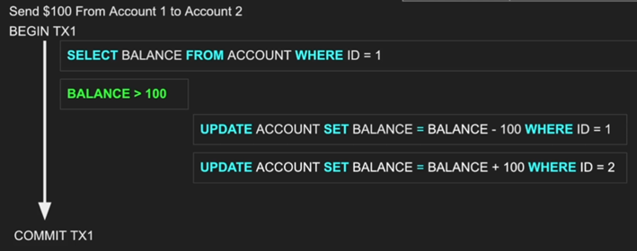
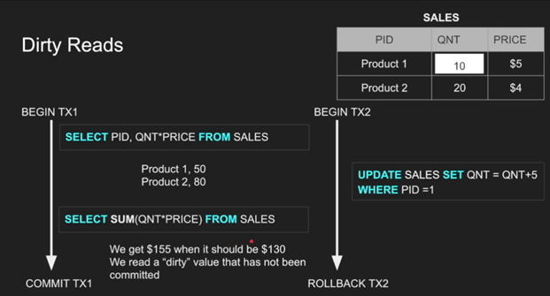
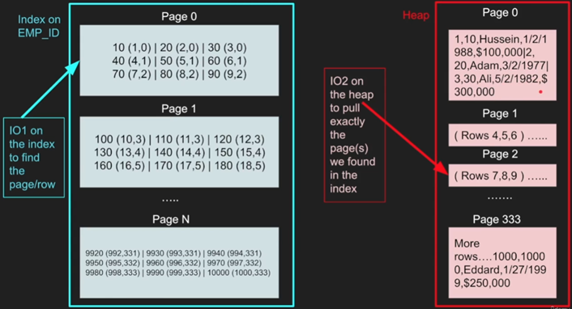
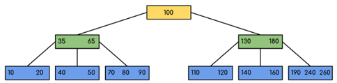
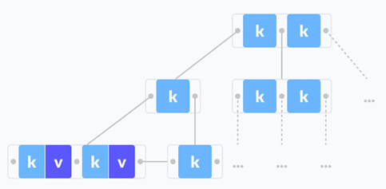
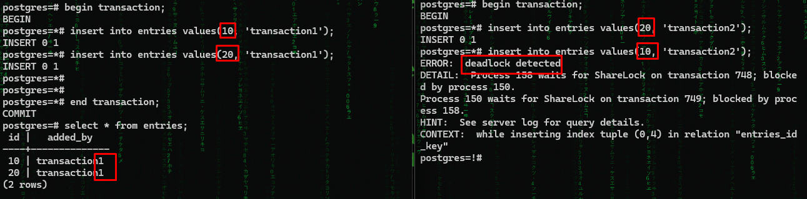
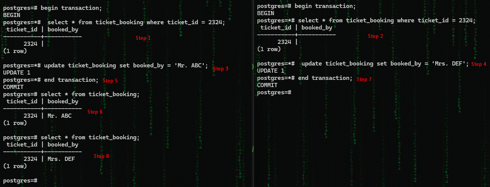
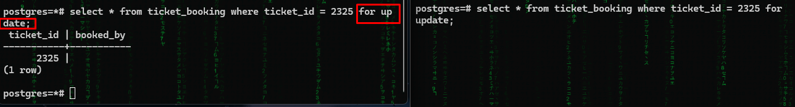
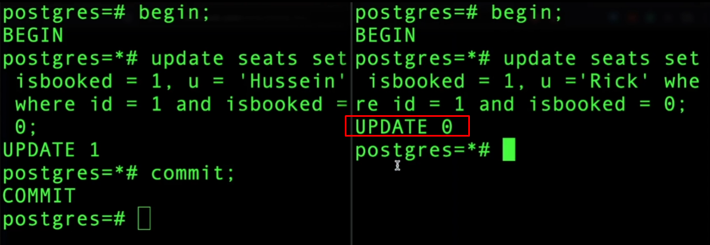

# ```Part 1: The ACID PRINCIPLE```
## ```Transaction```
-	Multiple queries treated as a single unit of work.
-	Transaction lifecycle consists of 4 parts internally: BEGIN, COMMIT 
(Store in memory/RAM), WRITE (Store in disk).
-	However, these can differ by DB engines, each DB engine has its own customized and 
complex transaction management system. Some focus more on commits some focus on crashes 
while some try to balance.
-	For COMMIT & WRITE there can be two approaches basically.
-	Each smaller unit is committed and written in disk -> needs lots of I/O, very fast, 
hard to rollback, used by Postgres
-	Every commit is prepared first then all are stored in disk -> slower, less IO, low 
failure chance, easier rollback
-	```But, what if the DB crash during a commit?```
-	Read only transaction is also normal, because it gives snapshot of a moment, without
transaction, in regular reads, things may get changed in the middle.

**Example of a transaction**




## `Atomicity`
Let’s say for the first example, we’ve deducted from the first account and then the 
DB crashed! The balance is never added in second account!
**Def: A block of queries must be executed entirely or none at all.**

## `Isolation`
Operations must be separated from all the outside-block actions. Traditional 
isolation related problems include ```Non-repeatable read``` 
(in a single block there are two read queries on the same table, after the first query 
another query from another thread updates data and commits so the second query reads 
different!), ```Dirty read``` (similar to non-repeatable but in this one, the second thread 
changes mind and doesn’t commit changes & rolls back after first thread’s second query),
```Phantom read``` (in this case, instead of updating, a new row is inserted by other thread. 
As it is completely new and first thread has no idea of it, so it is the hardest to fix),
```Lost update``` (the most common concurrency issue, two thread reads data, thread 1 updates it,
thread 2 updates it, the update of thread 1 is overwritten.)

**Example of dirty read:**



Different database uses different isolation levels by default to prevent different 
reading phenomena.

_Table: Isolation levels vs read phenomena_

| Isolation level | Dirty reads  | Lost updates | Non-repeatable reads | Phantoms |
|-----------------|--------------|--------------|----------------------|----------|
|Read Uncommitted| May occur    |May occur|May occur|May occur|
|Read committed| Don’t occur  |May occur|May occur|May occur|
|Repeatable read| Don’t occur  |Don’t occur|Don’t occur|May occur|
|Serializable| Don’t occur  |Don’t occur|Don’t occur|Don’t occur|

```Read uncommitted``` – No isolation, ```Read 
committed``` – a transaction only sees others’ committed transaction,
```Repeatable read``` – while a transaction is running, 
its usages rows will not be changed, kind of locking, 
```Serializable``` – disables concurrency,
```Snapshot``` – takes a snapshot of entire context and uses it during whole transaction.

Also, for locking, there are two types of locks. Pessimistic locks 
the context (row, table, page), Optimistic (doesn’t lock at all, triggers 
error/fail for a transaction when any anomaly happens.

## ```Consistency```
If a data is updated, all other related (other table, foreign key, 
other lined database etc.) and dependent data shall get the update immediately.

## ```Durability```
Database must store data in disk and shouldn’t lie without actually saving. As a result, DB engines ignores OS cache and stores data in disk by its own using f-sync commands.


# ```Part 2: Storing data```
A ```row``` is a single record, a `column` is a set of single attribute values, 
a `row_id` field is used by default in many databases which actually behaves 
like primary column internally, a `page` is a logical block with fixed size 
(8KB in Postgres, 16KB in MySQL) consists of multiple rows/columns, an `IO` is a read/write
operation, it reads one or more page at once, cannot read single row/column. IO is expensive. 
IO reads from OS Cache too, not always from disk. Optimizing an IO is DB engines’ 
one of the major goals, while reducing its use is programmers’ major goal. 
Tables are stored in `Heap` DS, traversing Heap is expensive as it gives you all 
pages and requires iterating through everything to find a row. Index is another 
DS which keeps pointers to heap using B-Tree. Example of reading from index & heap 
using two IO (imagine finding last row without index!)


Data storing can be both row and `column based`, the above one is example of row based,
however in column-based storing, only a limited (equals to number of columns) number of rows are created, each row contains all the values for a particular column. Example:


Good for aggregation, good for compression (as multiple record has same value so 
stored as value as a key with list of record id), very problematic in queries especially 
in select * queries!

###  Index oriented tables
An `index-oriented` table or a `clustered table` is the one which’s rows are 
organized based on the primary key, meaning that the row with primary key 
N+1 will always be after row N and before N+2. Fast but space-costly! i.e.: 
row with PK 1 and 3 are inserted, an empty row for PK 2 will be reserved. 
It’s by-default in MySQL, Postgres doesn’t have it (as it has a default PK internally 
and all user defined PK is actually SK), other DB allows to create it.

# `Part 3: Hands on with indexing`
Time to practice some indexing related queries!


```bash
# Run a Postgres docker container with custom password, custom name and latest docker version.
docker run -e POSTGRES_PASSWORD=postgres --name pg1 postgres;

# Log into Postgres in terminal
docker exec -it pg1 psql -U postgres;
```

```bash
# Create table emp
create table emp(id serial primary key, age int, salary int, experience int, rank int);

# Insert 10 million rows
insert into emp(age, salary, experience, rank) select random() * 50 + 18, 
random() * 190000 + 10000, random() * 20, random() * 9 + 1 from generate_series(0, 10000000);

# See table detail, total or rows 
\d emp; select * from emp limit 100; select count(*) from emp;
```


```bash
# Because id is PK and has indexing, this query took only 4.2ms in first run 
# and for any subsequent run it only took 0.32ms because of caching
explain analyze select * from emp where id = 1000222;

# Salary column doesn’t have index, it took 640ms without cache and 120ms with cache.
explain analyze select * from emp where salary = 51240;

# Now lets create index on salary field
create index emp_salary on emp(salary);

# The same previous query now took 9.6ms without cache and 0.91ms with cache!
explain analyze select * from emp where salary = 51240;

# Takes 600ms & 140ms with & without cache, because though salary is indexed but needed 
# to check all salary here.
explain analyze select * from emp where salary > 190000 and experience < 2 and age < 21;
# Note: If we change the condition to salary = something then query becomes extremely fast 
# because of indexing as expected. However, if we set salary condition in a way that it can 
# vary within a range then still the DB utilizes index!

```

### More on Indices
**`A scenario:`** If a table has columns a, b, c and we have index(a, b) then:
-	Query with ‘a or b’: parallel seq scan – 167ms -> same as without index
-	Query with ‘a and b’: index scan – 4ms -> fast because of index
-	Query with ‘b’: parallel seq scan – 176ms -> same as without index
-	Query with ‘a’: bitmap index scan – 6ms -> special case: as a column is first key in index, its fast!

There are different types of scans. `Index scan`, `Bitmap index scan`, `Table scan` 
(these names are based on PG, name can vary through DB’s however implements conceptually 
same thing). `Sequential scan or table scan` is the brute force, traditional, 
top to bottom iteration of pages and rows in a table. Parallel IO is used to make the 
scan faster, it is O(N) in terms of time complexity. `Index scan` is the faster one with 
O(logN) time complexity as it searches in the index tree, on the other side the 
`Bitmap index scan` is somewhere between the above two. Though index search 
is fast but jumping between index and the heap memory is costly as it requires 
IO, as a result, for a ranged query where there can be a lot of results the
DB engine first operates index scan and prepares a bit map for pages. For example –

| Page1 | Page2  | Page3 | Page4 | Page5 |
|-|-|-|-|-|
|0|0|1|0|1|0|

Of course, the actual table may be more complex with additional information but the 
minimal one shown here means that we need to scan page 3 and page 5 to prepare query 
result. So, it does index scan -> prepares bitmap then jumps to heap for once only.
Time complexity is same as index scan but this one is space costly because of the bitmap table.

**```Bloom filter```**: In cases where we require very simple yet extremely repetitive 
query such as whether an email or username exists or not, a hash-based elimination 
probability analyzer algorithm called bloom filter comes in! Using multiple hash functions 
and a bit array, it quickly and space-efficiently checks a probability of an items existence; 
query is executed only after it says the data may exist.

# `Part 4: Indexing data structures`
## B Tree 



### `Properties`
- All leaves are at the same level.
- B-Tree is defined by the term minimum degree t. The value of t depends upon disk block size.
- Every node except the root must contain at least t-1 keys.
- All nodes (including root) may contain at most (2*t – 1) keys.
- Number of children of a node is equal to the number of keys in it plus 1.
- All keys of a node are sorted in increasing order. The child between two keys k1 
and k2 contains all keys in the range from k1 and k2.
- B-Tree grows and shrinks from the root which is unlike Binary Search Tree. 
Binary Search Trees grow downward and also shrink from downward.
- Like other balanced Binary Search Trees, the time complexity to search, insert, 
and delete is O (log n).
- Insertion of a Node in B-Tree happens only at Leaf Node.
- Used as default in PostgreSQL 	Everything is  same as B Tree except for the 
value storing mechanism. In B+ tree the intermediate nodes doesn’t store any value, only keeps the keys and the leaf nodes stores values, additionaly the leaf nodes keeps a pointer  to the next node which brings lot of facilites wich such little cost.
- Used as default in MySQL, Oracle and most other DB systems. 

### `Search Efficiency`	
Good, as it maintains a balanced structure for efficient searching	Better, 
as all values are in leaf nodes, making range queries faster

### `Insertions/Deletions`
Efficient, with minimal re-balancing needed due to its balanced nature 
Efficient, similar to B-trees, but may involve more re-balancing

### `Space Utilization`
Can be less space-efficient as internal nodes store data
More space-efficient as only leaf nodes store data

### `Range Queries`
Less efficient, as search may involve traversing internal nodes	More efficient, 
as all data is at the leaf level, enabling faster range queries

### `Node Structure`	
Internal nodes store both keys and values, potentially making them larger	
Internal nodes store only keys, making them smaller and faster to navigate

### `Traversal`	
May require more traversals due to internal nodes storing data	More straightforward, 
as traversal is often limited to leaves for data retrieval
Indexing	Suitable for general indexing needs, including key-value pairs	
Ideal for indexing where range queries and sorted data access are common

    Code: Learn implementing B tree.

## B++ Tree



### `Properties`
Everything is  same as B Tree except for the value storing mechanism. In B+ tree the intermediate nodes doesn’t store any value, only keeps the keys and the leaf nodes stores values, additionaly the leaf nodes keeps a pointer  to the next node which brings lot of facilites wich such little cost.
Used as default in MySQL, Oracle and most other DB systems.

### `Search Efficiency`
Better, as all values are in leaf nodes, making range queries faster

### `Insertions/Deletions`
Efficient, similar to B-trees, but may involve more rebalancing

### `Space Utilization`
More space-efficient as only leaf nodes store data

### `Range Queries`
More efficient, as all data is at the leaf level, enabling faster range queries

### `Node Structure`
Internal nodes store only keys, making them smaller and faster to navigate

### `Traversal`
More straightforward, as traversal is often limited to leaves for data retrieval

### `Indexing`	
Ideal for indexing where range queries and sorted data access are common

    Code: Implement indexing using spring and hibernate: https://github.com/feehaam/Postgres_indexing_with_spring_jpa

# `Part 5: Distribution`
### `Partitioning`
Partitioning is `storing` rows (horizontal) or columns (vertical) `in multiple tables 
based on some logic.` The most common types of partitioning are `ranged` partitioning, 
`list` partitioning, `hash` partitioning, note that all these can be classified as horizontal
partitioning. Assume there is a many to many post-reaction table with columns 
(userId, postId, i reactionType, reactionTime), even doing index on userId or postId will 
not work because there can be billions of users and trillions of posts! So, what we 
can do is break the table based on id range! There will be multiple tables with same 
data each table containing a limited rage amount, for example the first table may have 
reactions with postId 1-10,000,000 next one with next 10 million then 10 and so on. 
Partitioning makes tables & queries `lighter`, `faster`, `complex`.

    Code: Implement paritioning using Java/Spring and PostgreSQL: https://github.com/feehaam/Postgres_partitioning_with_spring_hibernate_jdbc

### `Sharding`
Sharding is a different concept of distributing the data in `different databases`. 
It is needed `when there are so much data that the DB space is struggling`. It is very 
similar to partition but only in different server. Sharding can be employed by dividing 
the data based on a sharding key, such as user ID or geographical region. Each shard 
contains a subset of the data and operates independently, allowing the system to 
handle increased traffic and data volume by adding more servers as needed. This 
approach alleviates the performance `bottlenecks of a single server` and facilitates 
`horizontal scaling`. It also can offer `additional security` based on sharding key. 
Transaction, schema changes, joins, rollbacks is a real headache because of multiple databases.

    Code: Implement sharding across different databases using Java/Spring and PostgreSQL

### `Replication`
Replication is a technique used to enhance the availability and 
reliability of a database by creating and maintaining `multiple copies` of the same data 
across different servers. In replication, data changes made to a `primary` database 
(often called the `master`) are copied to one or more `secondary` databases 
(known as replicas or `slaves`). This ensures that if the primary database fails, 
the secondary copies can take over, `minimizing downtime and data loss`. For example, in a 
high-traffic e-commerce site, replication can be employed to distribute read queries 
among several replicas, thereby reducing the load on the primary server and 
improving overall performance. Replication also supports disaster recovery 
and backup strategies by keeping up-to-date copies of data in different locations. 
While it `introduces complexity in` managing data `consistency` and `synchronization` 
across multiple servers, replication is crucial for maintaining high availability 
and scaling read operations in critical applications.

    Code: Implement replication using Postgres and CQRS with it using Java/Spring, utilize connection pulling too


# `Part 5: Concurrency`
### `Shared lock & exclusive lock`
When `shared lock or read lock` applied on a/some row then it means that we're reading the rows 
and somebody `must not change or update` things in the middle of the way, whoever others can 
read and make more shared lock too, but while active no one can acquire an exclusive lock. 
`Exclusive lock or write lock` on the other hand doesn't allow others to both read and write, it
locks entirely because it means that I'm writing something everybody should read after I'm done
otherwise they will get some updated and some old values.

### `Deadlock`
Deadlock occurs when one thread(a) locks a part(a) and tries to access another part(b) but can't
because that part is locked by another thread(b) and that thread tries to access(a) and can't
as it is locked by thread(a), so thread(a) can't fining because of thread(b)'s lock and 
thread(b) also can't finish because of thread(a).

However in databases, waiting is allowed while locked, but the moment when deadlock starts
the thread that goes to deadlock second is immediately failed. 

In the below example, the column id is unique, first transaction 1 adds an entry 10 then 
transaction 2 adds 20, then right when transaction 1 tries to add 20 it starts waiting because
transaction 2 is working on the row that has id 20 and transaction 2 is still processing. 
But right when transaction 2 tries to add 10, it also starts waiting for T1 because it is working
or row 10 and still processing because waiting for T2 who is waiting for T1 who is waiting for T2
who is waiting for T1..... DEADLOCK! 

Then the DB engine terminates the T2 as it entered deadlock last so all of its changes are 
rolled back and see in the select query, both row is shown as added by T1. Note that T1 executes
right when T2 ends doesn't matter it ends normally or by rollback or by failure.



### `The two phase problem`
This is the problem where there are 2 or N same steps being executed by two threads in an 
ordered manner as a result the thread with last action wins. For example, lets say thread T1 and
thread T2 clicks to book two ticket at the same time. Both refresh same time so `ticket no 2324` 
is shown available (booked_by = null in below screenshot). Then both wants to book that ticket
T1 books it and ends the transaction then T2 books it and ends the transaction. Boom! T1's 
action is gone! See the below steps in screenshot.



Now as a solution to this, we can apply an exclusive lock on `ticket no 2325` from each thread, 
as shown in the screenshot, the second thread is not getting any result as thread 1's 
transaction is in progress, after thread 1 is done, thread two will execute the select query 
and notice that booked_by has a value. And won't attempt to book it.



Bellow, though both transactions started at the same time and both T1 and T2 got isBooked = 0 
then why the second update failed? 
Because, Postgres by default applies `read commited` and before commiting a transaction it reads values
again then it found isBooked = 1. This result may differ in different DB engines based on their implementations.



# `Part 6: Cursors`
While a ranged amount of data needed to be processed, the whole operation can be quite lengthy
and memory consuming, then server gets all. `Cursor` is the solution by which we can 
`create a stream of data`(Like future in Java), in is ready to be executed, 
`and we can get records chunk by chunk` from DB storage
using fetch query. It is quite useful way of sorting a table with huge size data because traditional 
sorting (Though DB engines do good RAM management still) may use too much RAM. There are two 
types of cursor: `Server side cursor` (Pros: handled by DB, better for large data, small network 
traffic, less client RAM, consistent data. Cons: complex, client stays in hold) & `Client side 
cursor` (Pros: By default this is what we do so no complexity, reduced server load, consistent data 
because of immediate data access. Cons: huge client memory, huge network traffic)

    Code: Implement server side and client side cursor using Java


# `Part 7: Security`

`Q:` Should you use create table if not exist (or ORM based table creation) from the web server? 
`A:` If I do this, the web server will have full privilege which is bad because the web server has drop
permission so SQL injection can destroy everything, another problem is what if there is another
web server that use the same table? There will be imbalance of access. So what I'll do is create
database independently then make connection pool with specific permissions for the web server. 
We can even create multiple pools for each web server even for each of the table but that may 
add extra level of configurations. Need to find a middle point in-between based on business.

`Q:` What is the best way of connecting database from server? 
`A:` Use SSL, use very long and unpredictable DB password, store the configuration info in some
vault area which will be utilized by the web server. 

`Q:` What is Homomorphic encryption? 
`A:` We can not just save everything encrypted into database prioritizing security because while 
querying, we'll need comparison and filter logic to be applied on plain text, can't do those on
cypher. Homomorphic encryption, introduced by IBM, so-called future of security, actually can
apply those on a cypher text! Of course, it is not magic, extra level of processing is needed, so 
it is ridiculously slow yet. That's why it is called ultimate security tech for 'future'.

Q: How UUID is bad? 
A: 

Q: In composite indexing what orders are best? 
A: When we're indexing, we don't care about space. We should consider how the B tree may 
respond quick, so we should put more selective(unique, less-repeat) field on the left. Let's assume
an index of productId and category, if we put category on left then there will be only a few first
level nodes each one containing huge amount of second. But using productId will do the reverse 
and result faster. 

Q: How indexes that are too large for RAM stored in disc and accessed?
A: 

https://www.qwertee.io/blog/postgresql-b-tree-index-explained-part-1/

Q: What is better, making a column non-null or putting null values or putting dummy value like 0?
Q: How does postgres determine a record in a row is null?
Q: Is there can be any difference in select count(*), select count(col_name) in a 
single column table? If yes then why would!? And when? 
Q: Why select * from t where c is null gives result but select * from t where c in [null] doesn't?
Q: Do databases support nulls in the index? 
