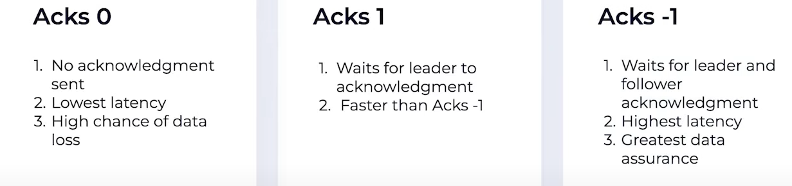
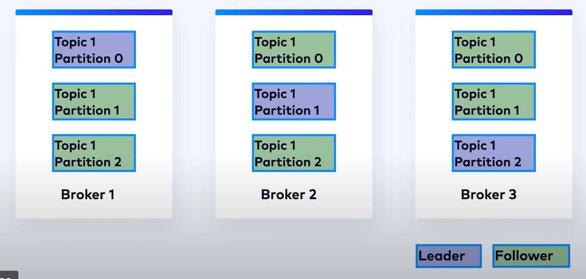
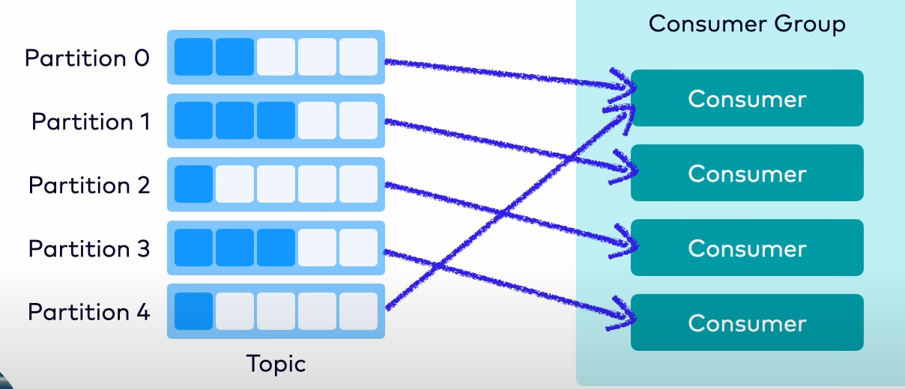
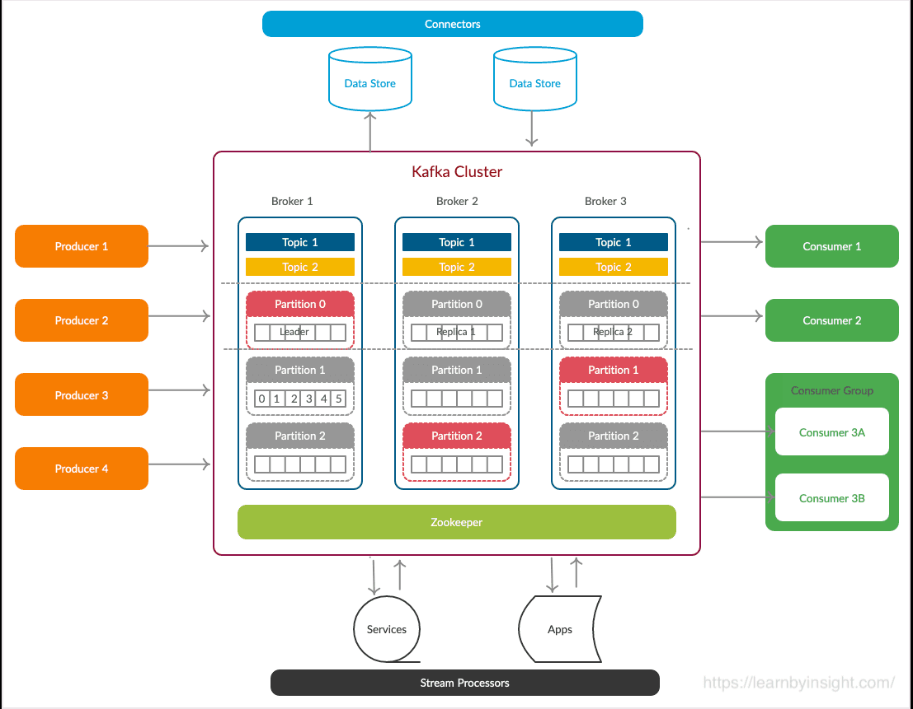
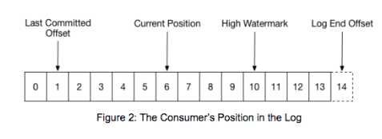
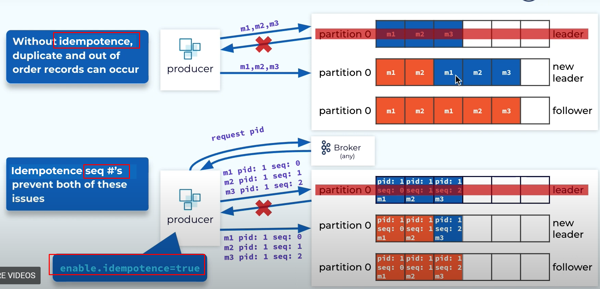
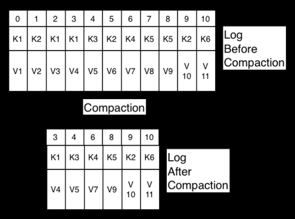

# Introduction

### Clusters
A Kafka cluster is typically comprised of several brokers.

### Brokers
A broker refers to a server in the Kafka storage layer that stores event streams 
from one or more sources. Every broker in a cluster is also a bootstrap server, 
meaning if you can connect to one broker in a cluster, you can connect to every broker.

### Topics
A topic is a log of events, similar to a folder in a filesystem,
where events are the files in that folder.
A topic has the following characteristics:
- A topic is append only, new messages are appended at the end.
- Events in the topic are immutable, can't be modified once written.
- A consumer reads a log by looking for an offset and then reading log entries that follow sequentially.
- Topics in Kafka are always multi-producer and multi-subscriber. There can be zero to 
many producers or consumers in a topic.
- Topics can't be queried but read. 
- Records are not deleted after consumed, rather flushed after a certain time period, like logs.

### Producer
Producers controls how events are assigned to partitions within a topic. 
This can be done in a round-robin fashion for load balancing or it can 
be done according to some semantic partition function such as by the event key.
Producer acknowledgements for message delivery are:


### Records
Records contains a key and a value. 
The key is used for partitioning and the value is the record itself. If a key is given
then the key is first hashed and then mod with the number of partitions. As a result, 
same key record will end up in the same partition and maintains order. 
A sticky partition is used when key is null, messages gets batched by size or time 
and assigned to a chosen partition, then next batch to next partition. It reduces latency
and processing cost but gives up order. 

### Partitions
Partitions are a logical grouping of events within a topic. Topics are broken 
up into partitions, meaning a single topic log is broken into multiple logs 
located on different Kafka brokers. This way, the work of storing messages, 
writing new messages, and processing existing messages can be split among many 
nodes in the cluster. This distributed placement of data is very important 
for scalability because it allows client applications to both read and write 
the data from/to many brokers at the same time. Additionally, there are two 
roles of partitions the leader & followers. Records are stored in the leader 
nd then copied to the followers.


### Consumers
The only metadata retained on a per-consumer basis is the offset or position of 
that consumer in a topic. This offset is controlled by the consumer. Normally a 
consumer will advance its offset linearly as it reads records, however, because 
the position is controlled by the consumer it can consume records in any order.

Consumer assignment for topic: Assigns one by one, if there is more partitions then
starts assign 2nd then 3rd and so on. Same thing happens when a consumer goes down. 


### Replication
Every topic can be replicated, even across geo-regions or datacenters.
common production setting is a replication factor of 3, meaning there will always be three 
copies of your data. This replication factor is configured at the topic level, and the unit of replication is the topic partition.
Under non-failure conditions, each partition in Kafka has a single leader and zero or more followers. 
In Kafka, all topics must have a replication factor configuration value. The replication factor includes the total number
of replicas including the leader, which means that topics with a replication factor of one (1) are topics that 
are not replicated. All reads and writes go to the leader of the partition. Followers consume messages from the leader 
like a Kafka consumer would and apply them to their own log. Followers pulling from the leader enables the follower to 
batch log entries applied to their log. If a node satisfies two conditions then that node is marked as `in sync`.
(1) Maintain session with controller, (2) Must not fall too behind of leader. 


## APIs
- Producer API: This API is used to produce messages to Kafka topics.
- Consumer API: This API is used to consume messages from Kafka topics.
- Admin API: This API is used to manage Kafka topics, brokers, and configurations.
- Connect API: This API provides a common framework for integration between databases, key-value stores, search indexes, file systems and Kafka brokers.
There are two types of connectors
  - Source connectors that act as producers for Kafka
  - Sink connectors that act as consumers for Kafka
- Stream API:  a stream processor is anything that takes continual streams of data from input topics, performs some
processing on this input, and produces continual streams of data to output topics.

### Final overview



# Internals
### Message storing mechanism
- Apache Kafka relies heavily on the file system for storing and caching messages.
- Kafka is built on top of the JVM
- A regular data storage use BTrees or similar data structures to maintain message metadata. Btree operations 
are O(log N), and O(log N), which is typically considered equivalent to constant time. the performance of tree 
structures is often super-linear, meaning doubling the data makes things worse than twice as slow. On the other
hand disk seek (uses hash) is quite faster but comes with limited parallelism. So, kafka use a persistent queue
like logging solutions, all operations are O(1) and reads do not block writes or each other. Performance is also
same regardless of data size. In summery: Sequential writes (appends), O(1) operations, independent read write, retention & replay.
- The broker appends the record to the end of the partition in a log file. Only the leader partitions writes, and followers reads.

### Message delivery
- Typical systems use byte-copying which is inefficient where there are many seekers (consumers) for a copy, 
that's why Kafka uses  a standardized binary message format that is shared by the producer, broker, and the consumer so 
that data chunks are transferred without modification. Using the zero-copy optimization(through pagecache & sendFile in OS)  data is copied into the pagecache 
exactly once and shared to all seekers to be reused. 
- Kafka groups messages together to form batches, overcoming network round-trip and reducing latency drastically.
- Kafka allows user to compress messages, batch compression offers more repetition and better compression, 
the compressed message then decompressed in the broker and validated by check whether all good as the headers says. 
Then the compressed message is saved in the log. For consumers then gets it and decompresses it. 
- Batch sizes are customizable, The batching can be configured:
  - By batch size (example: 64 kb). Use the batch.size property to set this.
  - By wait time (example: 10 ms). Use the linger.ms property to set this.
- Kafka follows a traditional messaging system design in that data is pushed by the producer to the broker and pulled from the broker by the consumer.

- There are three types of message sharing:
  - At most once: Messages are delivered once, and if there is a system failure, messages may be lost and are not redelivered.
  - At most once per message: This means messages are delivered one or more times. If there is a system failure, messages are never lost, but they may be delivered more than once per message.
    - Producer: Fire & forget, publishes the message and don't care whether broker got it. 
    - Consumer: Reads messages > saves position (offset pointer) > process messages, if fails before processing, then read messages are lost.
  - At least once: This means messages are delivered one or more times. If there is a system failure, messages are never lost, but they may be delivered more than once.
    - Producer: waits for confirmation, if not received then resend until gets confirmation, note: kafka eliminates duplicates by using idempotency.
    - Consumer: Reads messages > process messages > saves position (offset pointer). If fails before saving position, then duplicate readings occur. 
  - Exactly once: This is the preferred behavior in that each message is delivered once and only once. Messages are never lost or read twice even if some part of the system fails.
    - Producer: Same as at least once, or is it? 
    - Consumer: 
- Note that, above strategy is applicable for both producers and consumers. As it clearly understandable that 
a system with idempotency and at-least-once strategy is best of the both worlds, Kafka understood too. Since
version 0.11.0.0, the Kafka producer provides an idempotent option for configuring message delivery, however for
the consumers, we have to ensure in our service. The exactly-once strategy on the other hand uses transaction, ensuring durability losing speed.
- Kafka supports exactly-once delivery in Kafka Streams and uses transactional producers and consumers to provide
exactly-once delivery when transferring and processing data between Kafka topics. To do so, the consumer’s position 
is stored as a message in a topic, so offset data in written to Kafka in the same transaction as when processed 
data is written to the output topics. So if it fails, both data & offset pointer is lost. If it succeeded both are commited. 
However, things get dirty when external systems (i.e.: DB) involves. Kafka doesn't really have two-phase commit support.
As a result, for external systems, idempotency with at least once delivery is the only way to go.

Otherwise, by default Kafka guarantees at-least-once delivery. You can implement at-most-once delivery by disabling retries on the producer and committing offsets in the consumer before processing a batch of messages.

### Offset handling
- Consumers asks for messages specifying offset, then commits offset.
- Kafka manages consumer group states, tracking which consumers in a group have consumed which messages.
- For fault tolerance, if a consumer dies (stops), Kafka reassigns its partitions to another consumer in the same group.
- Kafka uses a Group coordinator to help balance the load across the group & re-balance in cases of membership changes.
  The coordinator uses an internal Kafka topic called __consumer_offsets to keep track of group metadata. Only one
  consumer can read from a partition at a time even though there are multiple consumers assigned for a partition.
  Consumer group is formed by the groupID. Each consumer sends heart beat to the broker. In case of no heart beat
  in time, a consumer gets removed and group gets re-balanced. After rejoin, it can use groupID and offset to resume.
- It is important that a messaging system track what has been consumed. Typically, this tracking is stored on the server.
  A consumer offset is used to track the progress of a `consumer group`. Since an offset is an integer, consumer state is
  relatively small. Also the offset is periodically check-pointed to the `__consumer_offsets` internal topic.
  This topic is used to store the current offset position for each consumer group, partition and consumer.
- Consumer flow example
  - The consumer’s current position at offset 6.
  - The last committed offset at offset 1. The last commited offset is the last message successfully processed.
  - The high watermark at offset 10. The high watermark is the offset of the last message that was successfully copied to all of the log’s replicas.
  - The log end offset at position 14. This is the offset of the last message written to the log.
  - 
  - When a partition gets reassigned to another consumer in the group, the initial position is set to the last committed offset. If the consumer in the example above suddenly crashed, then the group member taking over the partition would begin consumption from offset 1. In that case, it would have to reprocess the messages up to the crashed consumer’s position of 6. A consumer can only read up to the high watermark. This prevents the consumer from reading unreplicated data which could later be lost.
  - A console example - `bin/kafka-consumer-groups.sh \
            --bootstrap-server localhost:9092 \
            --describe --group my-group`
  - 


- How kafka ensures durability, order & duplicate elimination all together? 
Ans: lets say an event with 3 records m1, m2, m3 failed after first two records sent to the broker, 
then the producer resends all 3 messages again (because of this retry, durability is ensured). But there can be duplicates & miss-ordering because of retry!
Actually not; because when idempotence or exactly-once is enabled kafka sends 2 more params: the producerId & sequenceId, if message m1, and m2 is reached
then the next time even though producer sends all of those again but broker checks which pid & sid were received last then ignores until that and stores the rest.
like shown in the photo below. 


### Replicas 
- In Kafka, all topics must have a replication factor configuration value.
- Topics with a replication factor of one (1) are topics that are not replicated.
- Kafka replicates the event log for each topic’s partitions across a configurable number of servers. This replication factor is configured at the topic level.
- The leaders are evenly distributed among brokers, the logs in followers are eventually identical to the leader with same messages, offsets and order.
- Followers consume messages from the leader like a Kafka consumer would and apply them to their own log. Followers pulls logs by batch.
- For kafka, a node is marked as `in sync` (alive) if it satisfies two conditions:
  - Maintain session with controller (heartbeat)
  - Must not fall too behind of leader
- The leader keeps track of the set of in-sync nodes. If a follower fails, gets stuck, or falls behind, the leader will remove it from the list of in-sync replicas. 
- The `replica.lag.time.max.ms` configuration specifies what replicas are considered stuck or lagging.
- What about offset based removal? Well, kafka handles it internally in ISR management and there is no external config for that. 
- Also, the time based configuration indirectly controls offset base, becauseIf a replica is unable to keep up with offset, then it will eventually surpass the time limit, and be removed from the ISR.  
- The value for acks (all, 0, 1) determines the number of acknowledgments the producer requires from the broker before considering a message as successfully sent.
- Note that it has no relation with the replication factor, even if acks=1 (producer waits only for leader) all the in-sync replicas will still pull from the leader & consumer will get message only when all in-sync replicas got it.
```
Further read: A replicated log can be used as a primitive for implementing distributed systems in the state-machine style.
```

### Replicated logs: quorums, ISRs, and state machines
- Replicated Logs:
  - Kafka partitions use replicated logs, a fundamental tool for distributed systems, enabling state-machine implementations.
  - A leader orders log entries, and followers replicate this order, ensuring data consistency.
- Leader Elections and Quorums:
  - Upon leader failure, a new leader is elected, requiring up-to-date followers.
  - Quorums ensure committed messages are preserved after leader changes, balancing consistency and availability.
  - Majority vote quorums guarantee overlap but require a majority of replicas to be active.
- Kafka's ISR Approach:
  - Kafka uses In-Sync Replicas (ISRs), dynamically maintained sets of up-to-date replicas.
  - Only ISR members are eligible for leader election, ensuring data consistency.
  - Writes are not committed until all isr's have acknowledged the write.
  - The ISR approach allows Kafka to tolerate f failures with f+1 replicas.
- Recovery and Performance:
  - Kafka avoids strict "stable storage" requirements, allowing for faster recovery even with potential data loss on crashed nodes.
  - Kafka forces recovering nodes to fully resync before rejoining the ISR, protecting data consistency.
  - Majority vote has the advantage of only waiting for the fastest server to acknowledge.

### Unclean leader election and partition loss
- Kafka's data loss prevention requires at least one in-sync replica; if all replicas of a partition fail, this guarantee is compromised.
- There are two responses to all replicas failing:
  - Wait for an `in-sync` replica to return as the leader, ensuring data `consistency`.
  - Elect the `first available` replica (even if `not in-sync`) as the leader for higher `availability`.
- The choice is between availability and consistency; waiting for in-sync replicas may lead to downtime if they are lost, while using any available replica risks data inconsistency.
- By default, the system waits for consistent replicas (strategy 1), but this can be altered with the `unclean.leader.election.enable` setting.
- This tradeoff is common in quorum-based systems, not just in Kafka. 

### Replica Management
- Kafka manages numerous partitions, distributing them evenly across the cluster to avoid bottlenecks on individual nodes.
- Partitions are balanced round-robin across brokers, and leadership is also distributed to ensure each broker leads its share of partitions.
- Leadership elections, a key to minimizing downtime, are optimized by having a dedicated broker act as a "controller."
- The controller detects broker failures and quickly reassigns partition leadership, ensuring fast recoveries.
- If the controller itself fails, another broker automatically takes over the role to maintain cluster stability.

### Log compaction 
- Purpose: Log compaction ensures that Kafka keeps the latest value for each message key within a topic. This is useful for restoring state after failures or reloading caches.
- How it Works: Kafka retains the most recent message for each key, discarding older messages with the same key.
This allows for efficient storage and the ability to rebuild state by replaying the log.
- Use Cases:
  - Database change logs
  - Event sourcing
  - Maintaining application state for fault tolerance
- Key Concepts:
  - Compacted topics must have keys in messages.
  - Compaction happens in the background and doesn't block reads.
  - Deleted messages are marked with "tombstones" and eventually removed.


### Quotas
- Purpose:
  - Kafka quotas protect brokers from resource monopolization and denial-of-service attacks by controlling client resource usage.
  - Essential for multi-tenant clusters and Kafka-as-a-service offerings.
- Types of Quotas:
  - Network bandwidth quotas: Limit byte-rate thresholds (bytes per second).
  - Request rate quotas: Limit CPU utilization as a percentage of network and I/O threads.
- Client Groups:
  - Quotas are defined and applied to (user, client-id) tuples, creating logical client groups.
  - User principals identify authenticated users (or unauthenticated user groups).
  - Client ID's are generic group identifiers.
- Quota Configuration:
  - Default quotas can be overridden at various levels (user, client-id, or both).
  - Overrides are stored in ZooKeeper, allowing for dynamic updates without cluster restarts.
  - Precedence order exists for quota configuration.
- Enforcement:
  - Quotas are enforced on a per-broker basis.
  - Brokers calculate delay for quota violations and return responses with delay information.
  - Brokers mute client channels to stop processing requests during delays.
  - Clients also stop sending requests when they receive a delay response.
  - Measurement windows are small to enable fast detection and correction of quota violations.
<hr>
- If there are 3 in sync replicas, then 2 of them fails. One is completely dead, another one got timeout because of network. Then the timeout one becomes available few minutes later and for replacing the completely dead one, a new replica is initialized by the client. Note that minimum in sync is configured to be 1. Now explain me how each of the steps handled by Kafka?
- Is offset an integer? If yes than what is the maximum number of messages can be hold? What happen when the limit exceed? 
- Is log compaction inconsistent? It is not inconsistent however it offers a different type of consistency. In case of systems that require immutable complete history then log compaction is not a good choice as it may remove intermediate states.
In that case, time based retention is a better choice. However, for systems that require only the latest state, log compaction is a good choice.

## Some case studies 

## Kafka connect
What is Kafka connect?
Explain source and sync connector.
What are the workers & tasks & how are the rebalanced for fault tolerance?
What is the difference between standalone source and distributed source?
What is Kafka connector REST API's?
**SQL Selectron - for SQL DB UI**winget install --id Cloudflare.cloudflared