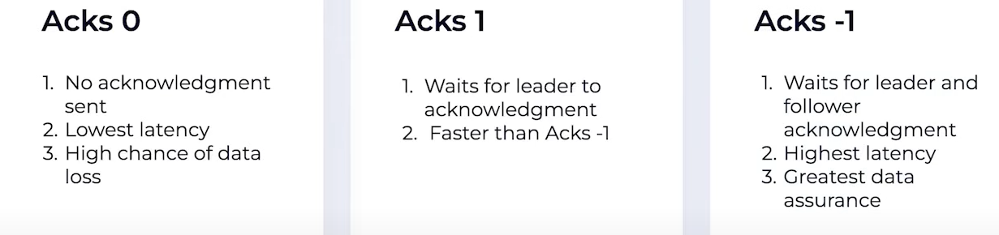
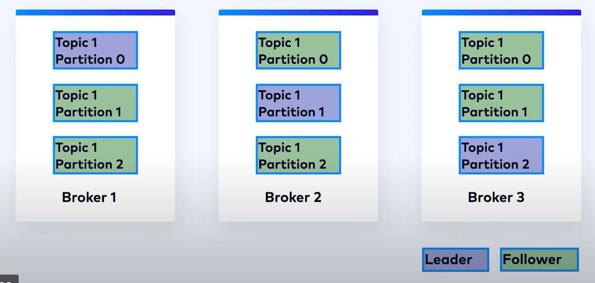
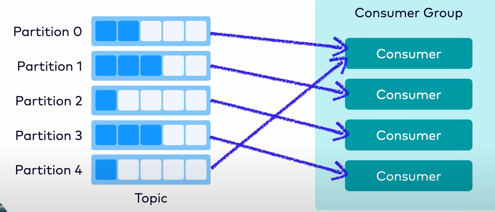
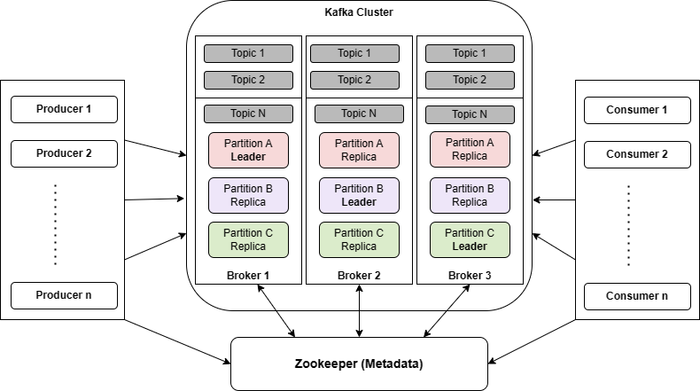
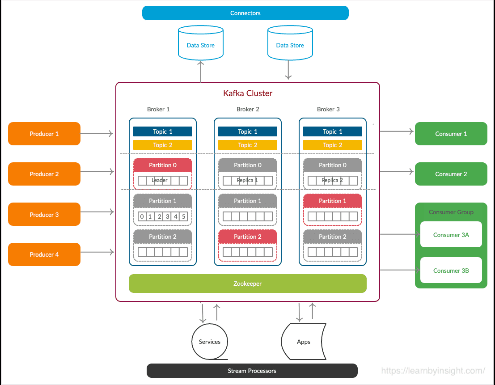
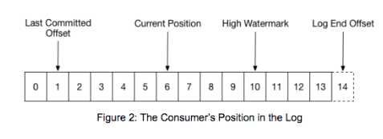
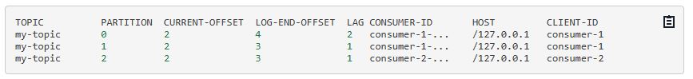

# Introduction

### Clusters
A Kafka cluster is typically comprised of several brokers.

### Brokers
A broker refers to a server in the Kafka storage layer that stores event streams 
from one or more sources. Every broker in a cluster is also a bootstrap server, 
meaning if you can connect to one broker in a cluster, you can connect to every broker.

### Topics
A topic is a log of events, similar to a folder in a filesystem,
where events are the files in that folder.
A topic has the following characteristics:
- A topic is append only, new messages are appended at the end.
- Events in the topic are immutable, can't be modified once written.
- A consumer reads a log by looking for an offset and then reading log entries that follow sequentially.
- Topics in Kafka are always multi-producer and multi-subscriber. There can be zero to 
many producers or consumers in a topic.
- Topics can't be queried but read. 
- Records are not deleted after consumed, rather flushed after a certain time period, like logs.

### Producer
Producers controls how events are assigned to partitions within a topic. 
This can be done in a round-robin fashion for load balancing or it can 
be done according to some semantic partition function such as by the event key.
Producer acknowledgements for message delivery are:

### Records
Records contains a key and a value. 
The key is used for partitioning and the value is the record itself. If a key is given
then the key is first hashed and then mod with the number of partitions. As a result, 
same key record will end up in the same partition and maintains order. 
A sticky partition is used when key is null, messages gets batched by size or time 
and assigned to a chosen partition, then next batch to next partition. It reduces latency
and processing cost but gives up order. 

### Partitions
Partitions are a logical grouping of events within a topic. Topics are broken 
up into partitions, meaning a single topic log is broken into multiple logs 
located on different Kafka brokers. This way, the work of storing messages, 
writing new messages, and processing existing messages can be split among many 
nodes in the cluster. This distributed placement of data is very important 
for scalability because it allows client applications to both read and write 
the data from/to many brokers at the same time. Additionally, there are two 
roles of partitions the leader & followers. Records are stored in the leader 
nd then copied to the followers.

### Consumers
The only metadata retained on a per-consumer basis is the offset or position of 
that consumer in a topic. This offset is controlled by the consumer. Normally a 
consumer will advance its offset linearly as it reads records, however, because 
the position is controlled by the consumer it can consume records in any order.

Consumer assignment for topic: Assigns one by one, if there is more partitions then
starts assign 2nd then 3rd and so on. Same thing happens when a consumer goes down. 

### Replication
Replication is an important part of keeping your data highly-available and fault-tolerant. 
Every topic can be replicated, even across geo-regions or datacenters.
common production setting is a replication factor of 3, meaning there will always be three 
copies of your data. This replication is performed at topic partition level.

## APIs
- Producer API: This API is used to produce messages to Kafka topics.
- Consumer API: This API is used to consume messages from Kafka topics.
- Admin API: This API is used to manage Kafka topics, brokers, and configurations.
- Connect API: This API provides a common framework for integration between databases, key-value stores, search indexes, file systems and Kafka brokers.
There are two types of connectors
  - Source connectors that act as producers for Kafka
  - Sink connectors that act as consumers for Kafka
- Stream API:  a stream processor is anything that takes continual streams of data from input topics, performs some
processing on this input, and produces continual streams of data to output topics.

### Final overview

# Internals
- Apache Kafka relies heavily on the file system for storing and caching messages.
- Kafka is built on top of the JVM
- A regular data storage use BTrees or similar data structures to maintain message metadata. Btree operations 
are O(log N), and O(log N), which is typically considered equivalent to constant time. the performance of tree 
structures is often super-linear, meaning doubling the data makes things worse than twice as slow. On the other
hand disk seek (uses hash) is quite faster but comes with limited parallelism. So, kafka use a persistent queue
like logging solutions, all operations are O(1) and reads do not block writes or each other. Performance is also
same regardless of data size. In summery: Sequential writes (appends), O(1) operations, independent read write, retention & replay.
- The broker appends the record to the end of the partition in a log file. Only the leader partitions writes, and followers reads.
- Consumers asks for messages specifying offset, then commits offset. 
- Kafka manages consumer group states, tracking which consumers in a group have consumed which messages.
- For fault tolerance, if a consumer dies (stops), Kafka reassigns its partitions to another consumer in the same group.
- Typical systems use byte-copying which is inefficient where there are many seekers (consumers) for a copy, 
that's why Kafka uses  a standardized binary message format that is shared by the producer, broker, and the consumer so 
that data chunks are transferred without modification. Using the zero-copy optimization(through pagecache & sendFile in OS)  data is copied into the pagecache 
exactly once and shared to all seekers to be reused. 
- Kafka groups messages together to form batches, overcoming network round-trip and reducing latency drastically.
- Kafka allows user to compress messages, batch compression offers more repetition and better compression, 
the compressed message then decompressed in the broker and validated by check whether all good as the headers says. 
Then the compressed message is saved in the log. For consumers then gets it and decompresses it. 
- Batch sizes are customizable, The batching can be configured:
  - By batch size (example: 64 kb). Use the batch.size property to set this.
  - By wait time (example: 10 ms). Use the linger.ms property to set this.
- Kafka follows a traditional messaging system design in that data is pushed by the producer to the broker and pulled from the broker by the consumer.
- Kafka uses a Group coordinator to help balance the load across the group & re-balance in cases of membership changes.
The coordinator uses an internal Kafka topic called __consumer_offsets to keep track of group metadata. Only one 
consumer can read from a partition at a time even though there are multiple consumers assigned for a partition. 
Consumer group is formed by the groupID. Each consumer sends heart beat to the broker. In case of no heart beat
in time, a consumer gets removed and group gets re-balanced. After rejoin, it can use groupID and offset to resume.
- It is important that a messaging system track what has been consumed. Typically, this tracking is stored on the server.
A consumer offset is used to track the progress of a `consumer group`. Since an offset is an integer, consumer state is 
relatively small. Also the offset is periodically checkpointed to the `__consumer_offsets` internal topic. 
This topic is used to store the current offset position for each consumer group, partition and consumer.
- Consumer flow example
  - The consumer’s current position at offset 6.
  - The last committed offset at offset 1. The last commited offset is the last message successfully processed.
  - The high watermark at offset 10. The high watermark is the offset of the last message that was successfully copied to all of the log’s replicas.
  - The log end offset at position 14. This is the offset of the last message written to the log.
  - 
  - When a partition gets reassigned to another consumer in the group, the initial position is set to the last committed offset. If the consumer in the example above suddenly crashed, then the group member taking over the partition would begin consumption from offset 1. In that case, it would have to reprocess the messages up to the crashed consumer’s position of 6. A consumer can only read up to the high watermark. This prevents the consumer from reading unreplicated data which could later be lost.
  - A console example - `bin/kafka-consumer-groups.sh \
            --bootstrap-server localhost:9092 \
            --describe --group my-group`
  - 
- There are three types of message sharing:
  - At most once: Messages are delivered once, and if there is a system failure, messages may be lost and are not redelivered. 
  - At least once: This means messages are delivered one or more times. If there is a system failure, messages are never lost, but they may be delivered more than once. 
  - Exactly once: This is the preferred behavior in that each message is delivered once and only once. Messages are never lost or read twice even if some part of the system fails.
  - Note that, above strategy is applicable for both producers and consumers. As it clearly understandable that 
  a system with idempotency and at-least-once strategy is best of the both worlds, Kafka understood too. Since
  version 0.11.0.0, the Kafka producer provides an idempotent option for configuring message delivery, however for
  the consumers, we have to ensure in our service. The exactly-once strategy on the other hand uses transaction, ensuring durability losing speed.

